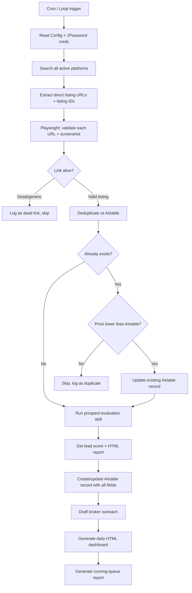

# EarnedOut Overnight Published Listing Search — Complete Revamp Plan

## Context

The current overnight search skill has fundamental issues: dead/generic links slip into Airtable, there's no way to tell when a lead was added, no integration with the existing prospect-evaluation scoring, no "maybe later" or "revisit" dispositions, missing 2025 financial fields, and notes reference search-results pages instead of specific business listings. This plan replaces the skill from the ground up.

## Decision Log (from user Q&A)

| Question | Answer |
|----------|--------|
| Credential storage | 1Password CLI (`op read`) |
| Recently-added UI | HTML dashboard file |
| Link validation | Headless browser validate + screenshot |
| Prospect eval scope | Full eval on ALL new leads |
| Disposition model | Single field (Active, Contacted, Maybe Later, Revisit for Roll-up, Passed, Dead Link) |
| Search platforms | Keep all current platforms |
| Daily report scope | Running queue (all undispositioned leads, not just last night) |
| Browser automation | Neither installed yet — set up Playwright MCP |
| Traceability | Store platform listing ID + direct URL |
| Skill location | Move both skills into a shared parent repo |
| Airtable new fields | Skill auto-creates missing fields |
| Price changes on existing listings | Re-evaluate and update when price drops |
| Manual URL submission | Support adding individual URLs on demand |

## Architecture Overview



## Repository Reorganization

Move both skills into a shared parent repo structure:

```
earnedout-workspace/
├── .claude/
│   └── skills/
│       ├── overnight-search/          # this skill (revamped)
│       │   └── skill.md
│       ├── prospect-evaluation/       # copied from Google Drive path
│       │   └── skill.md
│       └── submit-url/                # NEW: manual URL submission skill
│           └── skill.md
├── config/
│   ├── search_config.md               # existing, updated with new fields
│   ├── outreach_templates.md          # existing, updated with new template
│   └── credentials-setup.md           # NEW: 1Password setup instructions
├── references/                         # from prospect-evaluation skill
│   ├── buy-box-and-scoring.md
│   ├── industries-and-geography.md
│   └── research-playbook.md
├── templates/                          # from prospect-evaluation skill
│   ├── single-report.md
│   ├── single-report.html
│   ├── batch-screen.md
│   └── daily-dashboard.html           # NEW: template for daily report
├── output/
│   ├── reports/                        # prospect eval reports per lead
│   ├── screenshots/                    # listing page screenshots
│   └── dashboards/                     # daily HTML dashboards
├── search_reports/                     # existing location for run logs
└── README.md
```

**Migration steps:**
1. Create `earnedout-workspace` repo on GitHub
2. Copy prospect-evaluation skill files from Google Drive path into `references/`, `templates/`, `.claude/skills/prospect-evaluation/`
3. Move published-listing-search files into `.claude/skills/overnight-search/`, `config/`, `search_reports/`
4. Create the `submit-url` skill
5. Commit and push

## Step 0: Prerequisites — Playwright MCP + 1Password

**Playwright MCP setup:**
Add to `.claude/settings.json`:
```json
{
  "mcpServers": {
    "playwright": {
      "command": "npx",
      "args": ["@playwright/mcp"]
    }
  }
}
```
Install: `npm install -g @playwright/mcp`

**1Password credential retrieval:**
The skill reads DealStream credentials at runtime:
```bash
op read "op://Private/DealStream/username"
op read "op://Private/DealStream/password"
```
Document the expected 1Password item name/vault in `config/credentials-setup.md`. The skill should fail loudly if `op` is not signed in rather than proceeding without auth.

## Step 1: New Airtable Fields

The skill auto-creates these fields in table `tblSmNrHROMLm7vOS` (base `appOsvuyy5eK43QTx`) if they don't exist. Check via `list_table_fields`, create via Airtable API if missing.

| Field Name | Type | Purpose |
|------------|------|---------|
| Listing ID | Single line text | Platform-specific ID (e.g., DealStream `8gbw6e`) |
| Direct Listing URL | URL | Link to the specific business detail page (NOT search results) |
| Listing Screenshot | Attachment | PNG screenshot captured at time of discovery |
| Date Added | Date | Timestamp when the skill first found this lead |
| Date Updated | Date | Timestamp of most recent update (e.g., price change) |
| Previous Asking Price | Currency | Price before the most recent change (for price-drop tracking) |
| Link Health Status | Single select: Live / Dead / Redirect | Last validation result |
| Link Last Checked | Date | When the link was last validated |
| Disposition | Single select | Active / Contacted / Maybe Later / Revisit for Roll-up / Passed / Dead Link |
| Lead Score | Number (0-100) | Score from prospect-evaluation skill |
| Prospect Eval Report | URL | Path/link to the generated HTML report |
| 2025 Revenue | Currency | Revenue for 2025 |
| 2025 Cash Flow | Currency | Cash flow for 2025 |
| 2024 Revenue | Currency | Revenue for 2024 |
| 2024 Cash Flow | Currency | Cash flow for 2024 |
| Source | Single select: Overnight Search / Manual Submission | How the lead entered the pipeline |

**Existing fields retained:** All current field mappings (Business Name, Industry Match, Business Address, Website, Links, Lead Source, Broker Name, Asking Price, EBITDA, EBITDA Margin, Years in Business, Qty FT Employees, NAICS Code, Status, Priority Geography, Track, Tier, Notes).

**Key change to `Links` field:** The existing Links field (`fldwo7ui7aIGoMxAG`) currently stores the source listing URL. Going forward, `Direct Listing URL` (new) stores the specific business page. `Links` becomes a supplementary field for the search-results page or alternate URLs. This prevents the issue where notes reference a generic search page.

## Step 2: Revamped Search Workflow (skill.md rewrite)

### 2a. Read Config + Authenticate
- Read `config/search_config.md` and `config/outreach_templates.md`
- Retrieve DealStream credentials via `op read`
- Launch Playwright browser session
- Log into DealStream using retrieved credentials
- Verify login succeeded before proceeding

### 2b. Search All Active Platforms
For each active industry in config:
1. **DealStream (authenticated):** Navigate to DealStream search with industry keywords + geography filters. Paginate through results. For each listing, extract the **direct listing URL** (e.g., `dealstream.com/d/biz-sale/trade-contractor/6a89ka`) and the **listing ID** (e.g., `6a89ka`).
2. **BizBuySell, BizQuest, others (public):** Web search with industry keywords + state names. For each result, extract the direct listing URL and listing ID from the URL pattern.
3. **Critical rule:** NEVER store a search-results page URL as the listing link. Every lead must have a URL that resolves to a single business detail page. If a search result doesn't link to a detail page, skip it.

### 2c. Validate Each URL + Screenshot (Playwright)
For each candidate URL:
1. Navigate to the URL in Playwright
2. Check that the page contains listing-specific content (business name, asking price, description) — not a "listing removed" or "no longer available" message
3. If valid: capture a full-page screenshot, save as `output/screenshots/{listing-id}.png`
4. If dead/removed/generic: log it, skip to next
5. Record `Link Health Status = Live` and `Link Last Checked = now`

### 2d. Extract Structured Data
From each validated listing page, extract:
- Business Name, Industry, Location (City, State)
- Asking Price, Revenue, EBITDA or SDE
- Years in Business, Employee Count
- Broker Name, Broker Contact
- 2024 and 2025 Revenue/Cash Flow (if disclosed)
- Any undisclosed fields flagged as "needs broker follow-up"

### 2e. Deduplicate Against Airtable (with Price-Drop Detection)
- Query existing records from `tblSmNrHROMLm7vOS`
- Match on: Business Name + Business Address (existing logic) AND Listing ID + platform (new)
- For each match:
  - **Not in Airtable:** Proceed as new lead (Step 3)
  - **In Airtable, same or higher price:** Skip, log as duplicate
  - **In Airtable, LOWER price on website:** Treat as a price-drop update:
    1. Store the old price in `Previous Asking Price`
    2. Update `Asking Price` with the new lower price
    3. Set `Date Updated` to current timestamp
    4. Re-run prospect evaluation (Step 3) — the lower price may change the score
    5. Update the Airtable record with new Lead Score, new report, and a note: "PRICE DROP: was $X, now $Y (date)"
    6. Draft fresh broker outreach referencing the price reduction
    7. Include in the daily dashboard's "Last Night's Finds" section with a "PRICE DROP" badge

## Step 3: Prospect Evaluation Integration

For EVERY new deduplicated lead (and every price-drop update):

1. **Prepare input:** Create `output/reports/{listing-id}/` directory. Save the extracted structured data as a JSON file. Save the screenshot.
2. **Invoke prospect-evaluation skill:** The overnight-search skill calls the prospect-evaluation skill (from `.claude/skills/prospect-evaluation/skill.md`) with the lead data. This runs the full workflow:
   - Buy Box screening (6 hard criteria)
   - 26-field scorecard
   - 0-100 lead score with per-line math
   - Full deal memo (11 sections)
3. **Capture outputs:** The prospect-evaluation skill writes `{slug}-report.md` and `{slug}-report.html` into `output/reports/{listing-id}/`.
4. **Extract score:** Parse the lead score from the generated report.
5. **Store references:** The Airtable record gets the Lead Score (number) and Prospect Eval Report (path to HTML file).

This replaces the current approach where leads go into Airtable as raw data with no scoring. Every lead now enters the pipeline already evaluated.

## Step 4: Airtable Record Creation

For each new lead, create a record with ALL fields mapped:

**Existing field mappings** (unchanged IDs from current skill):
- Business Name, Industry Match, Business Address, Website, Lead Source, Broker Name, Asking Price, EBITDA, EBITDA Margin, Years in Business, Qty FT Employees, NAICS Code, Status, Priority Geography, Track, Tier, Notes

**New field mappings:**
- Listing ID → platform-specific ID
- Direct Listing URL → validated business detail page URL
- Listing Screenshot → attach the PNG from `output/screenshots/`
- Date Added → current timestamp
- Date Updated → current timestamp (same as Date Added for new leads)
- Link Health Status → "Live" (just validated)
- Link Last Checked → current timestamp
- Disposition → "Active" (default for new leads)
- Lead Score → from prospect-evaluation output
- Prospect Eval Report → path to HTML report
- 2025 Revenue → if disclosed on listing
- 2025 Cash Flow → if disclosed on listing
- 2024 Revenue → if disclosed on listing
- 2024 Cash Flow → if disclosed on listing
- Source → "Overnight Search"

**Notes field change:** Notes now always include: business name, listing ID, direct URL, and Airtable record URL. Never reference a search-results page. Include a one-line summary from the prospect evaluation.

## Step 5: Broker Outreach (revised template + response-rate improvements)

### Updated Default Template

The outreach email has been redesigned for higher response rates based on your current approach. Key template:

```
Subject: NDA & CIM request — Listing [LISTING_ID] | Biffrey Braxton Group

Hi [BROKER_NAME],

I'm Biffrey Braxton, Co-Founder & Chairman of Applied Development and 
co-founder of other firms, such as Inno-Native, FlexFly, and Intiendo.

My upcoming liquidity event will free capital that I plan to redeploy 
immediately into lower-middle-market acquisitions.

Your listing **[LISTING_ID] / "[BUSINESS_NAME]"** fits my buy-box:

* 10+ yrs operating history
* EBITDA $1+ MM
* < 4× EBITDA pricing
* Team of >10 FTEs

Because timing is critical, I would like to:

1. **Execute an NDA today** (yours or our standard form).
2. **Receive the Confidential Information Memorandum** and any teaser 
   deck, data room link, or financial supplement you normally provide.
3. Schedule a 20-minute follow-up call with you within 48 hours.

Please see my website to better understand my motivation: 
https://smbsteward.com/

Looking forward to working together.

Best regards,

Biffrey Braxton
📞 443-864-2408 ✉️ bbraxton@applied-dev.com
```

### Suggestions to Increase Response Rate

1. **Personalize the subject line:** Include the business name or industry, not just listing ID. Brokers get dozens of generic inquiries. Example: `NDA & CIM request — [BUSINESS_NAME] (Listing [LISTING_ID]) | Biffrey Braxton Group`

2. **Lead with proof of funds / closing ability:** Brokers prioritize buyers who can close. Move the liquidity event mention higher and make it more concrete: "I'm closing a liquidity event in [month] that provides $[X]M in deployable capital" — even a range signals seriousness vs. "upcoming."

3. **Reference the specific listing details:** Show you actually read the listing. Add one line like: "The [INDUSTRY] focus, [CITY] location, and [YEARS]-year operating history make this a strong fit." This takes 10 seconds and separates you from spray-and-pray buyers.

4. **Drop the bullet list (or make it conversational):** The buy-box bullet list reads like an automated filter. Instead: "Your listing fits what I'm looking for — established business with a decade-plus track record, strong cash flow, and a team I can build on."

5. **Add a social proof sentence:** "I've completed [N] acquisitions in the [industry] space" or "I'm currently operating [X] portfolio companies" — even if the number is small, it shows you're not a first-time buyer kicking tires.

6. **Make the CTA even easier:** Offer to send YOUR NDA proactively: "I've attached our standard NDA — happy to sign yours instead if you prefer." Removing friction increases reply rate.

7. **For price-drop re-outreach:** When a listing's price drops, send a follow-up: "I noticed the asking price for [BUSINESS_NAME] has been adjusted. I'd like to re-engage on this opportunity. Can we schedule a call this week?"

8. **A/B test subject lines specifically:** The current odd/even A/B test changes the whole email body. Instead, keep the body consistent and A/B test just the subject line — that's where most response-rate variance comes from.

### Template Selection Logic (updated)
- **Aviation leads (Part 135, Part 145):** Use Template C (Aviation-specific language)
- **Price-drop re-outreach:** Use price-drop follow-up template (new)
- **All others:** Use the updated default template above
- **A/B testing:** Rotate subject line variants, not body text

### Storage
- Outreach stored in Airtable Notes field AND compiled into `search_reports/outreach_drafts_YYYY-MM-DD.md`
- Outreach for "Revisit for Roll-up" leads is deferred (not drafted until disposition changes)

## Step 6: Manual URL Submission Skill

Create a new skill at `.claude/skills/submit-url/skill.md` that lets you manually introduce an opportunity to the pipeline.

**Usage:** When you find a listing URL outside the overnight search (e.g., forwarded by a broker, found on LinkedIn, spotted at a conference), you can submit it:
- Invoke the skill with the URL
- The skill runs the same pipeline as the overnight search: Playwright validation + screenshot → data extraction → dedup check → prospect evaluation → Airtable record creation → outreach draft
- Sets `Source = "Manual Submission"` instead of "Overnight Search"
- Generates or updates the daily dashboard to include the new lead

**Skill definition:**
```
---
name: submit-url
description: Submit a business-for-sale listing URL to the EarnedOut pipeline. Validates the link, extracts data, runs prospect evaluation, and adds to Airtable.
---

You are adding a manually-submitted business listing to the EarnedOut acquisition pipeline.

1. Accept one URL from the user
2. Validate the URL using Playwright (same logic as overnight search Step 2c)
3. Extract structured data from the listing page (Step 2d)
4. Check for duplicates in Airtable (Step 2e, including price-drop detection)
5. Run the prospect-evaluation skill on the lead (Step 3)
6. Create/update the Airtable record with Source = "Manual Submission" (Step 4)
7. Draft broker outreach if broker info is available (Step 5)
8. Regenerate the daily dashboard to include this lead
9. Display the lead score and a summary to the user
```

## Step 7: Daily HTML Dashboard (addresses issues #3 and #9)

Generate `output/dashboards/dashboard_YYYY-MM-DD.html` — a styled, self-contained HTML file.

**Structure:**

### Section A: Last Night's New Finds (+ Price Drops)
Table sorted by lead score descending:
| Rank | Score | Business Name | Industry | State | Asking Price | EBITDA | Source | Report Link |
- Each "Report Link" opens the prospect-evaluation HTML report for that lead.
- Price-drop updates show with a badge and "was $X → now $Y" notation.
- Manual submissions from that day also appear here.

### Section B: Running Queue (all undispositioned leads)
Same table format, includes ALL leads where Disposition = "Active" regardless of when they were added. Sorted by score descending. Shows Date Added column so you can see age.

### Section C: Revisit Bucket
Leads with Disposition = "Revisit for Roll-up" — too small for foundation but potential roll-up targets. Sorted by score.

### Section D: Run Summary
- Total leads searched, new leads found, duplicates skipped, dead links caught
- Price drops detected and re-evaluated
- Manual submissions added
- Leads per industry, leads per platform
- Any errors or platform blocks encountered

**Template:** Create `templates/daily-dashboard.html` as a Jinja-style template with CSS styling matching the prospect-evaluation report aesthetic.

## Step 8: Disposition Workflow (addresses issues #2 and #5)

Single `Disposition` field with these values:

| Value | Meaning | When to use |
|-------|---------|-------------|
| Active | New lead, not yet reviewed | Default for all new leads |
| Contacted | Broker outreach sent | After sending email |
| Maybe Later | Interesting but not right now | Timing isn't right, market conditions, etc. |
| Revisit for Roll-up | Too small for foundation, valuable as add-on later | Sub-$2M EBITDA companies in target industries |
| Passed | Reviewed and rejected | Doesn't fit buy box or strategic criteria |
| Dead Link | Listing no longer available | Link validation finds the page is gone |

The daily dashboard filters on Disposition to populate its sections. "Maybe Later" and "Revisit for Roll-up" leads stay visible in the running queue but are grouped separately so they don't clutter the active pipeline.

## Issue-to-Fix Traceability

| Issue # | Problem | Fix |
|---------|---------|-----|
| 1 | DealStream credentials not linked | 1Password CLI retrieval at runtime (Step 0) |
| 2 | No "maybe later" disposition | New Disposition field with "Maybe Later" value (Step 8) |
| 3 | No recently-added screen | Daily HTML dashboard with "Last Night's Finds" section (Step 7) |
| 4a | Dead/inaccurate links in Airtable | Playwright validates every URL before it enters Airtable (Step 2c) |
| 4b | No way to know when a lead was added | New "Date Added" field, auto-set on creation (Step 1) |
| 4c | Screenshot at time of add | Playwright captures screenshot, stored as attachment (Step 2c) |
| 5 | No "revisit" for roll-up targets | "Revisit for Roll-up" disposition value + dashboard section (Step 8) |
| 6 | Missing 2025 revenue/cash flow | New 2025 Revenue and 2025 Cash Flow fields (Step 1) |
| 7 | Notes reference search pages, not specific businesses | Direct Listing URL + Listing ID fields; notes always include business name + listing ID + direct URL (Steps 2b, 4) |
| NEW | Price drops on existing listings missed | Price-drop detection in dedup step triggers re-evaluation (Step 2e) |
| NEW | No way to manually add a URL | Submit-URL skill (Step 6) |
| NEW | Outreach template needs improvement | Revised template with response-rate suggestions (Step 5) |

## Implementation Order

1. **Repo setup** — Create `earnedout-workspace`, migrate files from both skill repos
2. **Playwright MCP** — Install and configure, verify it can launch a browser
3. **1Password integration** — Create `config/credentials-setup.md`, test `op read` retrieval
4. **Airtable field creation** — Add the new fields listed in Step 1
5. **Rewrite overnight-search `skill.md`** — Incorporating Steps 2-5, 7-8
6. **Create submit-url skill** — Step 6
7. **Update outreach templates** — Step 5
8. **Daily dashboard template** — Create `templates/daily-dashboard.html`
9. **Test run** — Execute the skill manually, verify: DealStream login works, screenshots captured, prospect eval runs, price-drop detection works, Airtable records created with all fields, dashboard generated
10. **Schedule** — Set up via `/schedule` or cron for nightly execution

## Verification

After implementation, verify end-to-end:
1. `op read` successfully retrieves DealStream credentials
2. Playwright logs into DealStream, navigates to a search page, can paginate results
3. A known-good listing URL is validated + screenshot captured
4. A known-dead URL (e.g., one of the examples from issue #4) is correctly flagged and skipped
5. Prospect-evaluation skill runs on a test lead and produces both `.md` and `.html` reports
6. Airtable record is created with all new fields populated (Date Added, Listing ID, Direct URL, Screenshot attachment, Lead Score, Disposition = Active)
7. Price-drop detection: modify a test record's Asking Price to be higher than the website price, re-run, verify the record is updated with Previous Asking Price and a new score
8. Manual URL submission: run submit-url skill with a test URL, verify it goes through the full pipeline
9. Daily dashboard HTML opens in browser, shows test leads in Section A (with price-drop badge if applicable), links to HTML reports
10. Running queue (Section B) pulls all undispositioned leads from Airtable
11. A lead marked "Revisit for Roll-up" appears in Section C, not Section B
12. Notes field contains business name, listing ID, and direct URL (not a search-results page)
13. Broker outreach email uses the updated template with personalized details
